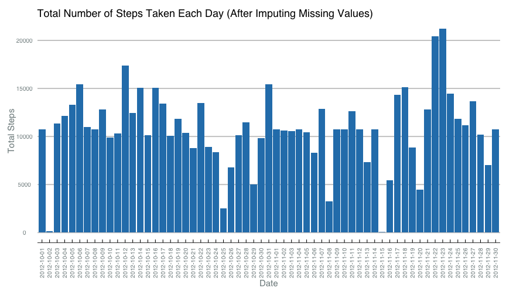

# Reproducible Research: Peer Assessment 1


## Loading and preprocessing the data

If the zip archive containing the activity monitoring dataset is not already present we download it from https://d396qusza40orc.cloudfront.net/repdata%2Fdata%2Factivity.zip. The csv file containing the activity monitoring data is then extracted from the archive and loaded into a data frame. No further preprocessing steps are needed.

```r
if (!file.exists("activity.zip")) {
  fileUrl <- "https://d396qusza40orc.cloudfront.net/repdata%2Fdata%2Factivity.zip"
  download.file(fileUrl, destfile = "activity.zip", method = "curl")
}
tempdir <- tempfile()
dir.create(tempdir)
unzip("activity.zip", exdir=tempdir)
filesInArchive <- list.files(tempdir)
if (length(filesInArchive) > 1) {
  stop("Expected only one file in the zip archive but found more than one!")
}
fileName <- paste(tempdir, filesInArchive[1], sep = "/")
df <- read.csv(fileName, stringsAsFactors = FALSE)
```


## What is mean total number of steps taken per day?

We are interested in the distribution of daily total number of steps. To obtain this we first group the dataset by date and compute the total number of steps for each day (ignoring missing values). 

```r
library(reshape2)
library(plyr)
dailySteps <- ddply(df, .(date), summarise, totalSteps = sum(steps, na.rm = TRUE))
```
We can now use the intermediate data frame produced above to make a histogram of the number of steps taken each day.

```r
library(ggplot2)
library(RColorBrewer)
library(scales)
library(ggthemes)

old <- theme_set(theme_economist_white(gray_bg=FALSE))
theme_update(
    plot.title = element_text(size=18, family="Helvetica", color="black", hjust=0),
    axis.text.y = element_text(size=10, family="Helvetica", color="#7F8C8D"),
    axis.text.x = element_text(size=10, family="Helvetica", color="#7F8C8D"),
    axis.title.x = element_text(size=15, color="#7F8C8D"),
    axis.title.y = element_text(size=15, angle=90, color="#7F8C8D")
)
p <- ggplot(dailySteps, aes(date, totalSteps))
p <- p + geom_bar(stat="identity", fill="#2980B9")
p <- p + labs(
    title = "Total Number of Steps Taken Each Day",
    x = "Date",
    y = "Total Steps"
)
p <- p + theme(axis.text.x = element_text(angle = 90))
plot(p)
```

 

The mean and median daily total number of steps are 9354.23 and 10395 respectively.


## What is the average daily activity pattern?

In order to get the average daily activity pattern we first group the dataset by 5-minute interval and then compute the average number of steps across all days (ignoring missing values). 

```r
avgDailyActivity <- ddply(df, .(interval), summarise, avgSteps = mean(steps, na.rm = TRUE))
```
We can now make a time-series plot of the average daily activity.

```r
p <- ggplot(avgDailyActivity, aes(interval, avgSteps))
p <- p + geom_point()
p <- p + geom_line(size=1.2, colour="#2980B9")
p <- p + labs(
    title = "Average Daily Activity Pattern",
    x = "5-min interval",
    y = "Average Steps"
)
plot(p)
```

 

From the above chart we can see that 5-minute interval 835, on average across all the days in the dataset, contains the maximum number of steps.

## Imputing missing values
The total number of missing values in the dataset is 2304. We will fill in each of these missing values with the mean of the corresponding 5-minute interval.

```r
for (idx in 1:nrow(avgDailyActivity)) {
  fillVal <- avgDailyActivity[idx, "avgSteps"] 
  currInterval <- avgDailyActivity[idx, "interval"]
  df[is.na(df$steps) & (df$interval == currInterval),]$steps <- fillVal
}
```
Let's examine the impact of the above imputation step. First we see if the distribution of daily total number of steps has changed.

```r
dailySteps2 <- ddply(df, .(date), summarise, totalSteps = sum(steps, na.rm = TRUE))
p <- ggplot(dailySteps2, aes(date, totalSteps))
p <- p + geom_bar(stat="identity", fill="#2980B9")
p <- p + labs(
    title = "Total Number of Steps Taken Each Day (After Imputing Missing Values)",
    x = "Date",
    y = "Total Steps"
)
p <- p + theme(axis.text.x = element_text(angle = 90))
plot(p)
```

 
After imputing missing values the mean and median daily total number of steps are 10766.19 and 10766.19 respectively, which are higher than the values obtained by simply ignoring the missing values. So imputing the missing values increased our estimates of the total daily number of steps.

## Are there differences in activity patterns between weekdays and weekends?
First introduce a variable that can be used to split the data frame into weekend vs weekday measurements.

```r
df$dayOfWeek <- weekdays(as.Date(df$date))
df$isWeekend <- "weekday"
df[df$dayOfWeek == "Saturday" | df$dayOfWeek == "Sunday",]$isWeekend <- "weekend"
df$isWeekend <- factor(df$isWeekend, levels = c("weekday", "weekend"))
```
Now we can plot the activity patterns for each of the two groups

```r
avgDailyActivity2 <- ddply(df, .(interval, isWeekend), summarise, avgSteps = mean(steps, na.rm = TRUE))
p <- ggplot(avgDailyActivity2, aes(interval, avgSteps))
p <- p + facet_grid(isWeekend ~ .)
p <- p + geom_point()
p <- p + geom_line(size=1.2, colour="#2980B9")
p <- p + labs(
    title = "Average Daily Activity Pattern Weekdays vs. Weekend",
    x = "5-min interval",
    y = "Average Number of Steps"
)
plot(p)
```

 
